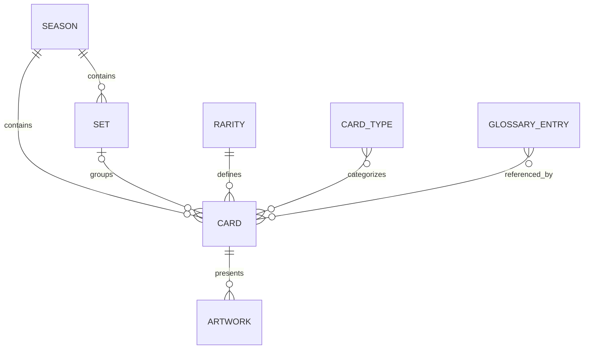

# Safir Codex data model

## Principles

- Firestore document IDs are the internal identifiers. They are injected as `id` by converters and are not duplicated inside documents.
- Slugs are stable, human-readable URL identifiers. They are indexed fields, not primary keys.
- Relationships use document IDs (`seasonId`, `setId`, `rarityId`, and `typeIds`) instead of translated labels.
- All main entities carry Firestore `createdAt` and `updatedAt` timestamps. Repositories write these with `serverTimestamp()`.
- Firestore documents remain normalized until measured performance requires deliberate denormalization.



## Collections

### `cards/{cardId}`

A card stores its stable `slug`, number, reference IDs, stats, flags, translations, primary artwork, optional alternatives, and timestamps. `number` is not globally unique: two seasons or sets may both contain card `#001`. `setId` is nullable because a card does not have to belong to a set.

Stats (`attack`, `value`, `defense`) are integers from 0 through 9 and are validated at runtime. `isPromo` and `isCommander` are intentionally simple flags. Future promo categories can be modeled through dedicated sets or an additional entity without changing existing IDs.

`isFeatured` supports the Landing Page without copying card data into another collection.

### `seasons/{seasonId}`

A season has a number, stable slug, localized content, optional cover, optional release date, and `isActive`/`isFeatured` flags.

### `sets/{setId}`

`sets` is the canonical technical name for editions. A set belongs to one season. Cards may refer to a set or keep `setId: null`.

### `rarities/{rarityId}`

Rarities are entities rather than strings. `order` controls display order independently of translations. Optional visual metadata stores a color and Storage icon path.

### `cardTypes/{cardTypeId}`

Types are referenced from cards through `typeIds`. A card may have zero, one, or several types. Names and descriptions are never copied into card documents.

### `glossaryEntries/{entryId}`

`key` is a stable, language-independent identifier such as `silence`, `move`, or `on-play`. `slug` is kept separately for future URLs. Labels and definitions are localized.

## Translations

Localized fields use an open record:

```ts
translations: {
  fr: { name: "Gardienne", description: "…" },
  en: { name: "Warden", description: "…" },
}
```

The database is not limited to the configured interface locales. Adding `ja`, `de`, or another BCP 47-style key does not require a schema migration.

Translation resolution follows:

1. exact requested locale (`fr-CA`);
2. base language (`fr`);
3. fallback locale (`en`);
4. first available translation;
5. `undefined` when the map is empty.

`SUPPORTED_LOCALES`, `DEFAULT_LOCALE`, and `FALLBACK_LOCALE` live in `src/lib/i18n/locales.ts`.

## Glossary references

The canonical inline syntax is:

```txt
[[glossary:silence]]
```

The stored key is independent of the displayed language. `extractGlossaryReferences`, `getGlossaryKeys`, and `tokenizeGlossaryContent` identify these references without imposing a React rendering strategy. Legacy strings such as `|Déplacer|` should be migrated to `[[glossary:move]]` before becoming functional references.

## Artwork and Storage

Firestore persists `storagePath` as the source of truth. A cached `url` is optional because download URLs can change. `getStorageDownloadUrl()` resolves a current Firebase download URL when needed.

Path conventions:

```txt
cards/{cardId}/main/artwork.webp
cards/{cardId}/alternatives/{artworkId}.webp
seasons/{seasonId}/cover.webp
rarities/{rarityId}/icon.svg
card-types/{cardTypeId}/icon.svg
```

Artwork orientation describes presentation (`vertical` or `horizontal`), not necessarily the physical orientation of a complete card.

## Repositories and converters

The data path is:

```txt
UI → feature service → server-only repository → Firebase Admin / Firestore
```

Converters inject `document.id` and validate every read with Zod. Repositories validate create/update DTOs, use generated Firestore IDs, and apply server timestamps. Firebase Admin modules carry `import "server-only"` so a Client Component cannot import them accidentally.

`CardDetails` resolves a card with its season, optional set, rarity, and types on the server. These values are not duplicated in Firestore.

## Indexes and future queries

The committed indexes cover the queries already represented in repositories:

- cards by `seasonId`, ordered by `number`;
- cards by `setId`, ordered by `number`;
- sets by `seasonId`, ordered by `releaseDate`.

Firestore creates single-field indexes for simple filters. Add composite indexes only when a real query combines filters such as season + rarity + number or season + `array-contains(typeIds)` + number. Firebase error links can generate the exact missing index.

Firestore is not used as a full-text search engine. Advanced name/description search may later be delegated to Algolia, Typesense, Meilisearch, or another dedicated index.

## Security

`firestore.rules` permits public reads only for the six Codex collections and denies every client write. `storage.rules` permits reads only below the documented public asset roots and denies every client upload. Admin writes bypass rules and must stay in trusted server scripts or future protected admin routes.

These rules must be extended with custom claims or another role system before the admin dashboard writes from an application flow.

## Seed behavior

The development seed validates all data before connecting, uses Firebase Admin, and is idempotent by slug/key. It refuses live projects unless `--allow-live` is passed explicitly and refuses `NODE_ENV=production`. Placeholder Storage paths are written, but no binary artwork is uploaded.
